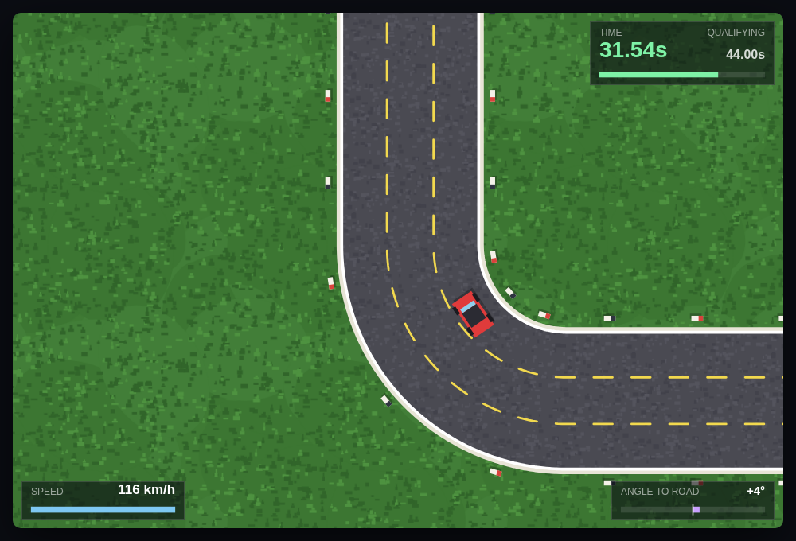
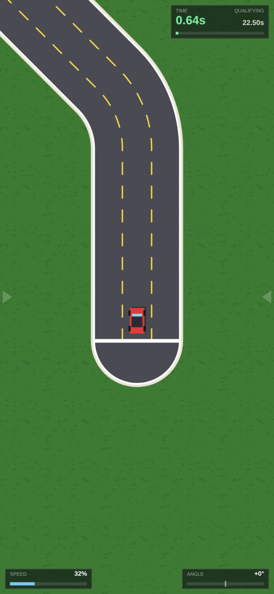

# BlockRacer2 — Stage 1

A top-down 2D time trial. The car accelerates on its own, there is no brake, and
the only thing you control is the wheel. Beat the qualifying time.





## Running it

No build step and no dependencies. Open `index.html` in a browser.

The scripts are plain (non-module) so `file://` works — double-clicking the file
is enough. If you prefer a server:

```
npm start        # http://localhost:8080
```

## Controls

| Key | Touch | Action |
| --- | --- | --- |
| <kbd>&larr;</kbd> / <kbd>A</kbd> | hold the **left half** of the screen | Steer left |
| <kbd>&rarr;</kbd> / <kbd>D</kbd> | hold the **right half** of the screen | Steer right |
| <kbd>Enter</kbd> / <kbd>Space</kbd> | tap the button | Start / race again |
| <kbd>R</kbd> | | Restart |
| <kbd>P</kbd> / <kbd>Esc</kbd> | | Pause |

There is no throttle and no brake. Acceleration is automatic.

The title screen shows whichever set of controls applies to the device. On a
touch screen, faint arrows mark the two steering halves while racing; sliding a
finger across the middle switches sides without lifting it, and multi-touch is
handled so holding one side and tapping the other behaves.

## Sense of speed

The car sits at a fixed point on screen, so everything telling you that you are
moving is in the scenery. That has to be built deliberately, and it is
measurable: how much of the screen actually changes from frame to frame.

Measured on a straight at Full Speed, over ~80ms:

| | pixels visibly changing | mean pixel change |
| --- | --- | --- |
| Before | 3.1% | 1.20 / 255 |
| After | **29.2%** | **6.99 / 255** |

At 3% the road genuinely read as static. Four things were wrong, all fixed:

* **The grass was nearly flat.** It covers most of the screen, and its two
  tones differed by about 5% — invisible at speed. It now has real contrast,
  many more tufts, several tones and broad patches underneath. The texture is
  isotropic on purpose: banding gives no cue when travelling along the bands,
  and this track runs in every direction. The tile wraps properly at its edges,
  so the repeat does not show as a grid.
* **Nothing marked the roadside.** The white edge line is continuous, and a
  continuous line looks identical however fast it moves. There are now marker
  posts down both verges (`markerSpacing`, 120px — about 3.5 a second flicking
  past at Full Speed), with alternating bands so consecutive posts differ as
  well as recur.
* **The road surface was flat colour**, in the middle of the screen where you
  are actually looking. It now has a low-contrast asphalt grain.
* **The camera never reacted to speed**, so 33% and 100% looked alike bar how
  fast things slid past. It now pulls back as the car speeds up (`speedZoom`,
  18% wider flat out). The zoom only ever *widens* the view, so the guarantee
  below still holds — the tightest the camera ever gets is a standing start.

The HUD also shows a real speed in km/h rather than a percentage of an abstract
maximum (`pixelsPerMetre` sets the conversion; the car is 56px long and a real
hatchback is about 4.3m).

`tools/browser-test.js` measures the optic flow and fails below 15%, so this
cannot quietly regress.

## Screens and resolutions

The game fills whatever screen it is on — phone, tablet or desktop, portrait or
landscape — and re-measures on rotation, resize, and when mobile browser chrome
slides in and out.

**The scale is chosen so no screen has an advantage.** This matters because the
game is scored against a qualifying time: if a phone saw less road ahead than a
desktop, 22.50s would be a harder target on the phone. So the world-to-screen
scale is set from the **shorter screen axis** against a fixed world extent
(`viewMinWorld`, 600px). Every display sees at least 600 world pixels in every
direction; larger or wider ones see more, never less. Physics are in absolute
world units and never consult the viewport, so lap times match across devices —
the test suite drives a full lap on a phone and on a desktop and compares them
(they land within 0.02s of each other). The speed zoom above is applied on top
of this and only ever widens the view, so the stationary camera is the tightest
it ever gets — the suite checks the extent is exact at a standstill and never
below the guarantee at speed.

| | CSS size | Backing store | World visible |
| --- | --- | --- | --- |
| Small phone | 320×568 | 640×1136 | 600×1065 |
| Phone portrait | 390×844 | 780×1688 | 600×1298 |
| Phone landscape | 844×390 | 1688×780 | 1298×600 |
| Tablet | 820×1180 | 1640×2360 | 600×863 |
| Desktop | 1280×800 | 1280×800 | 960×600 |

The canvas renders at device pixel ratio (capped at 2 — a 3× phone costs 9× the
fill rate for very little visible gain). The HUD scales with the shorter axis
and its panels are capped against the real screen width, so they cannot overlap
on a narrow display. On the title screen the settings panel scrolls internally
rather than the whole overlay, so **Start Race** is never below the fold.

Camera look-ahead is taken per axis, each as a fraction of what that axis can
see. That keeps the car in the same spot on screen everywhere while letting a
tall portrait phone turn its height into visible road ahead — a single distance
along the heading does neither, leaving portrait wasting half a screen on empty
road behind, or shoving the car off the side on a diagonal.

## How the steering works

This is the part worth understanding, because it is not how most racing games
behave.

The car's heading is real state. What the **Turning Angle** limits is the
*offset* between the car's heading and the direction of the road underneath it:

```
offset = car heading − road heading at the car's position,   |offset| ≤ Turning Angle
```

* Holding left or right pushes the offset outwards, at `steerRateDeg` per second,
  until it hits the Turning Angle. Because the limit is on the *offset*, the car
  can never rotate more than that away from the road and can never spin around.
* Releasing the keys lets the offset fall back towards **0**, which means
  "pointing the same way as this part of the track". So after a left-hander
  the car settles at 45° in world terms — which is 0° relative to the road — and
  holds it. That is the behaviour the design asks for.
* That fall-back is **proportional**, not a fixed rate: `returnRateDeg` is the
  speed at 45° of offset, and it scales down linearly from there. A car at full
  lock snaps back hard; a nearly-straight car is barely nudged.
* Even so, the car **cannot follow a corner unaided**. Every bend turns at
  112°/s. Let go mid-corner and you run ~180px wide on a road whose edge is
  96px from the centre, and spend about 20s of a 32s lap on the grass. Corners
  have to be driven.

Why proportional return matters: a *constant* rate ties responsiveness to
difficulty and you cannot have both. Fast enough to feel good (≥80°/s) and a
hands-off car just follows the bends; slow enough to keep the corners honest
(40°/s) and the car takes over a second to straighten up against a 0.22s
turn-in — a 5:1 asymmetry that plays like a boat. That was the first tuning of
this game, and it was wrong. Proportional return separates the two concerns:

| | first tuning (constant 40°/s) | now (proportional 170°/s) |
| --- | --- | --- |
| Turn-in to full lock | 0.22s | **0.17s** |
| Half the angle back | 0.57s | **0.18s** |
| Fully settled | 1.06s | **0.71s** |
| Hands-off lap | fails | fails |

`tools/simulate.js` asserts both halves — the corners stay demanding *and* the
steering stays responsive — so neither can regress by accident.

Running onto the grass is not a crash — it caps you at 45% of full speed until
you get back on the tarmac, which is usually enough to lose qualifying. After 3s
off the road the car is lifted back onto the racing line at half speed
(`offRoadResetSeconds`, set to 0 to disable); see *Notes* below for why.

## Track 1

Track 1 is a base layout, then the whole thing again with **every turn
reversed** — a left becomes a right and vice versa:

| | Base | Mirror |
| --- | --- | --- |
| | Straight 1s | Straight 1s |
| | Left 45° + straight 3s | **Right** 45° + straight 3s |
| | Right 45° + straight 3s | **Left** 45° + straight 3s |
| | Left 45° + straight 3s | **Right** 45° + straight 3s |
| | Straight 1s | Straight 1s |
| | Left 90° + straight 3s | **Right** 90° + straight 3s |
| | Right 90° + straight 3s | **Left** 90° + straight 3s |
| | Left 90° + straight 3s | **Right** 90° + straight 3s |
| **Qualifying** | | **44.00s** |

40s of track, twelve corners. The mirror is generated from the base list in
`config.js` rather than written out twice, so editing the base changes both
halves. The mirrored half unwinds exactly the rotation the base half puts in,
so the car finishes pointing the way it started, and the two halves do not
overlap — the closest approach between distant parts of the track is 490px
against a 192px road, which the test suite checks.

Road is **3 lanes** — 6 car widths (192px) with two dashed dividers. Grass
either side.

Every corner shares the same **214px radius**: the 90° turns take twice the arc
time (0.8s vs 0.4s) for twice the angle. That matters — a 90° turn taken in
0.4s would have a 107px radius against a 96px half-width, leaving an 11px inner
edge, which is a kink rather than a corner.

Sections are defined in **seconds at full speed**, not in pixels, so changing
Full Speed makes the track physically longer and a clean lap still takes about
the same time — it just feels faster and gives you less time to react.

A clean lap is about **39.7s** (the racing line cuts inside the centreline on
twelve corners, so it beats the 40s the centreline would take), leaving ~11%
slack — the same proportional margin every earlier version had.

## Going off the road

Grass holds the car to **Grass Slowdown** percent below Full Speed — 50% by
default, so 58 km/h against 116 on tarmac. After 3s off the road the car is
lifted back onto the racing line at half speed (`offRoadResetSeconds`, 0
disables); see *Notes* for why.

What that is worth in lap time, measured:

| | Lap | Cost |
| --- | --- | --- |
| Clean | 39.70s | — |
| One 3s excursion | 42.23s | 2.53s |
| Two 3s excursions | 44.53s | 4.83s |

Against a 44.00s target and a 4.30s margin, **one mistake survives and two do
not**. Note this is softer than the original 10s track, where 1.2s of slack
made any mistake fatal: a fixed proportional margin buys more absolute room as
the track grows. If you want one excursion to end the run, drop
`qualifyingTime` to about 42s.

## Configuration## Configuration

The four headline settings are on the title screen **and** in `config.js`:

| Setting | Default | Range |
| --- | --- | --- |
| Turning Angle | 45° | 5–90° |
| Acceleration (time to full speed) | 2.0s | 0.2–10s |
| Steering Speed | 280°/s | 60–6000 |
| Straighten Speed | 170°/s | 30–400 |
| Grass Slowdown | 50% | 0–90% |
| No. Laps | 1 | 1–20 |
| Full Speed | 420 px/s | 120–1200 |

Each slider shows the ends of its range and, where it helps, what the value
actually does — sideways speed, time to full lock, time to straighten — so a
value can be judged before racing.

**Steering Speed** is how fast the car turns while you hold a key; raising it
only makes the car more responsive to you, so it costs nothing in difficulty.
**It also saturates**, well below its maximum, because the car stops turning
once it hits the Turning Angle:

| Steering Speed | to full lock | centre → road edge | max sideways speed |
| --- | --- | --- | --- |
| 280°/s | 0.167s | 0.292s | 297 px/s |
| 600°/s | 0.075s | 0.250s | 297 px/s |
| 6000°/s | 0.008s | 0.217s | 297 px/s |

Ten times the steering speed buys 33ms — two frames at 60Hz. Sideways speed is
pinned at `Full Speed × sin(Turning Angle)` in all three cases. If the car does
not change direction hard enough, **Turning Angle** is the dial (at 90° sideways
speed goes from 297 to 420 px/s), or **Full Speed**, which scales it directly.
**Straighten Speed** is how fast it swings back when you let go — this one is a
difficulty dial too. Past roughly 190°/s the car tracks the corners on its own
and a hands-off lap qualifies, at which point there is no game left; the test
suite will tell you if you cross that line.

`config.js` is the source of truth. Title-screen changes are saved per-browser
in `localStorage` and layered on top; **Reset to file defaults** discards them.
Values are clamped on both paths, so a bad hand-edit cannot make the game
unplayable.

**Grass Slowdown** is the speed the grass costs you, so 50% holds the car to
half of Full Speed. At 0 the grass costs nothing and the road edges stop
mattering, which removes the only penalty for missing a corner. The physics use
the surviving fraction; `BR.deriveConfig` works that out, and everything that
builds a config — the title screen, saved settings and the headless harness —
goes through it, so they cannot drift apart.

`config.js` also holds the off-road recovery, car and road dimensions, the
visual tuning, and the Track 1 section list itself.

## Tests

```
npm test            # headless physics harness (no browser)
npm run test:browser  # drives a full lap in headless Chromium (needs Playwright)
```

`tools/simulate.js` loads the real `config.js`, `track.js` and `car.js` in a VM
and runs the same fixed-step loop as the game. It checks that a clean lap
qualifies without being a free pass, that a hands-off lap leaves the road, that
the Turning Angle clamp holds at full lock, that acceleration reaches full speed
in exactly the configured time, and that all this survives the extremes of every
title-screen setting. Section 8 pins the steering-feel numbers in the table
above so responsiveness cannot regress.

`tools/browser-test.js` loads the page in Chromium and covers the title-screen
sliders, range labels and reset button; a full lap driven with real key events;
layout and world scale across six resolutions from a 320px phone to an
ultrawide; the optic flow on a straight; touch steering on a phone viewport
(including that it never scrolls or zooms the page); and that a lap on a phone
takes the same time as one on a desktop.

## Notes and known limitations

* Physics run at a fixed 1/120s step, independent of display refresh rate — lap
  times are the same on a 60Hz and a 144Hz monitor.
* **Multi-lap is a soft target.** Track 1 is point-to-point, so laps after the
  first restart the car at the start line carrying its speed. Those rolling-start
  laps are about 1s quicker than the standing-start first lap, while the
  qualifying target is a flat `44s × laps`. Setting laps above 1 therefore gets
  easier, not harder. A closed circuit in a later stage would fix this properly.
* **Off-road recovery is an addition to the brief**, which has no crash or
  recovery rule. It is a playability feature rather than a safety net: because
  the Turning Angle clamp keeps the car within 45° of the road direction, the
  car always retains a forward component and always reaches the line either way
  — I assumed otherwise at first and the test in `tools/simulate.js` disproved
  it. What recovery actually fixes is the state you are left in. Realigning the
  car's *heading* with the road does nothing to pull its *position* back, so
  without it a botched corner leaves you running parallel to the track and over
  1200px wide of it for the rest of the lap, with the road off screen. Set
  `offRoadResetSeconds: 0` in `config.js` for strict brief behaviour.
* Apart from that there is no collision or damage model; the speed cap and the
  recovery are the only consequences of leaving the road.
* The camera translates but does not rotate, so corners read as corners.
